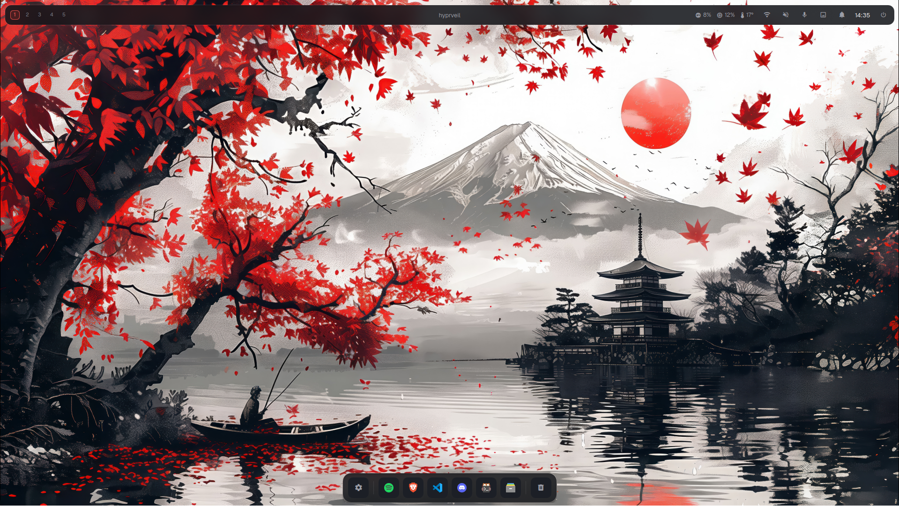
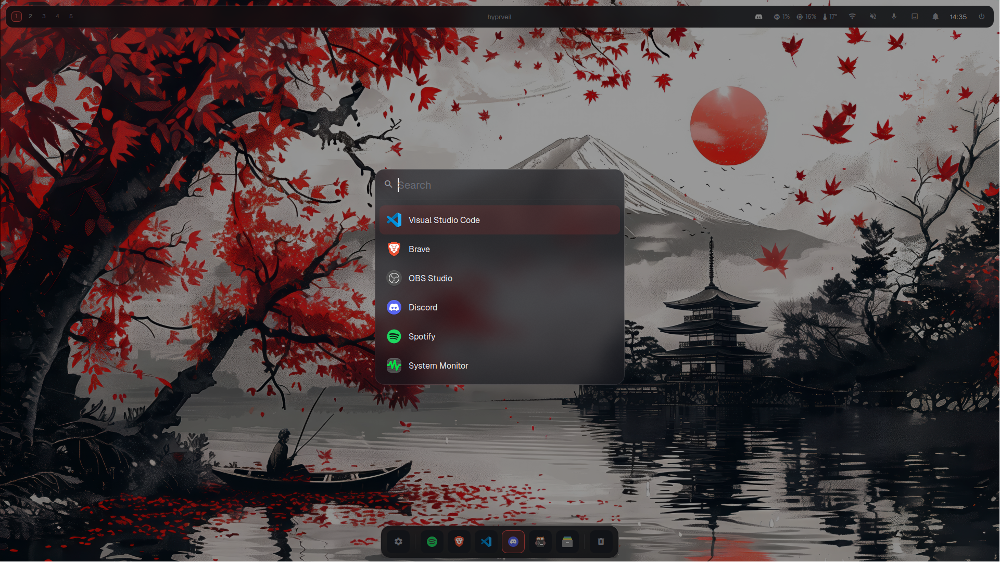
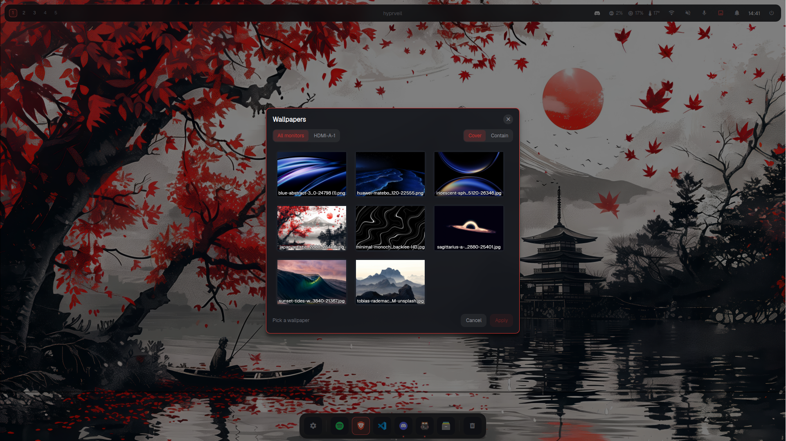
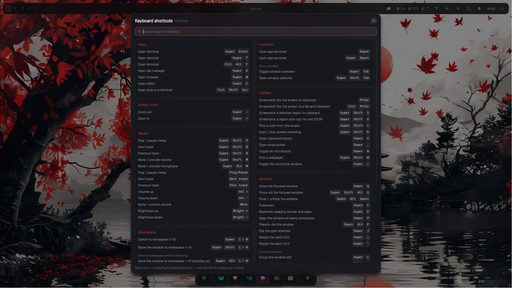
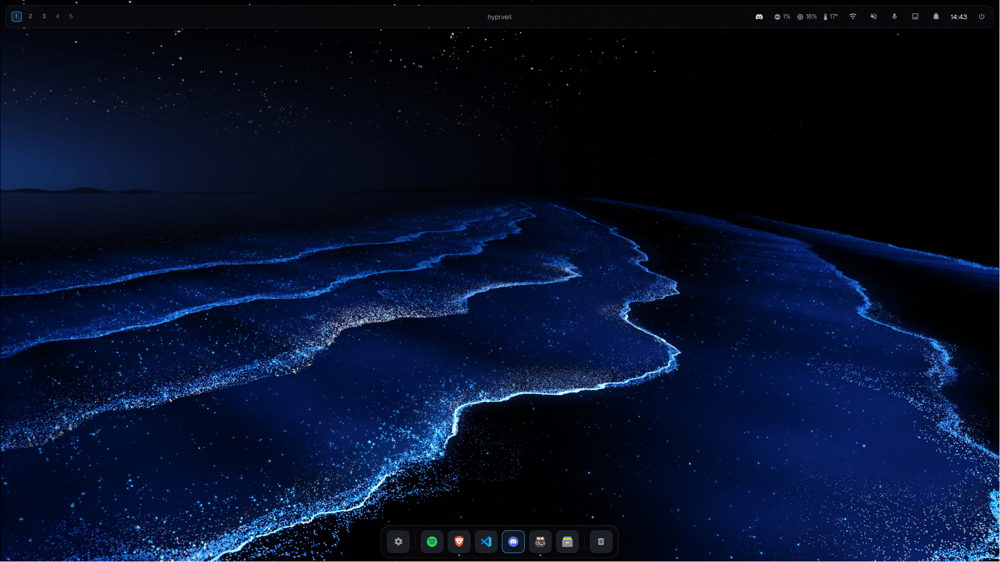

# Hyprveil

[](https://github.com/tiagogp/hyprveil/actions/workflows/quality.yml)

Hyprveil is a reusable Fedora Hyprland desktop template with a dark glass visual
system, a Quickshell-based shell, wallpaper-aware accents, persistent hardware
profiles, and a cautious installer that backs up managed configuration before
replacing it.

The default desktop is Quickshell QML: it draws the floating top bar, bottom dock,
Quick Settings, notification popups/history, wallpaper picker, keybind cheatsheet,
and lock screen. Waybar remains in the repository as a legacy/fallback bar, while
SwayNC and Mako are notification-only fallbacks for systems that do not run the
Quickshell notification backend.

## Screenshots

| | |
|---|---|
|  Desktop — bar, dock, wallpaper-derived crimson accent |  Launcher — rofi, centered, accent selection |
|  Wallpaper picker — per-monitor fit, live accent preview |  Keybind cheatsheet — searchable, grouped by category |

Accents are wallpaper-derived, not fixed — the same shell re-themed from a blue
wallpaper:



*(Lock screen, notification, and power menu screenshots are still pending — see
[CONTRIBUTING.md](CONTRIBUTING.md#screenshots) if you'd like to contribute a set.)*

## Requirements

- Fedora 44 or Fedora 43. Other Fedora versions may work, but they are outside
  the release-tested support window in `support/fedora-releases.conf`.
  Hyprveil targets one distribution and one compositor on purpose: the
  installer probes real DNF/COPR package sources and the config assumes
  Hyprland, and supporting more of either would mean testing configurations
  no one commits to a smoke test. Porting the config by hand to another
  distro or compositor is reasonable; the installer will not attempt it for
  you.
- A Wayland-capable system that can run Hyprland.
- `dnf`, Bash, and a user account allowed to install packages with `sudo`.
- Network access during package installation, unless all required packages are
  already installed from enabled repositories.

## Install

```bash
chmod +x scripts/*.sh
./install.sh
```

The installer probes enabled Fedora repositories first, offers COPR fallbacks only
when needed, records package-source choices, preserves state under
`$XDG_STATE_HOME/hyprveil`, and creates timestamped backups before replacing
Hyprveil-managed config trees. It is safe to rerun.

Important warnings:

- Run `./hyprveil setup` after installing to detect monitors and pick keyboard,
  apps, and idle timers. For common single-monitor hardware the shipped catch-all
  layout already works; `setup` is what handles multi-monitor and custom scale
  without hand-editing `~/.config/hypr/monitors.conf`.
- Hyprveil replaces only its managed configuration trees, but you should still
  read [docs/INSTALL.md](docs/INSTALL.md) and [docs/RECOVERY.md](docs/RECOVERY.md)
  before installing on a daily-driver machine.

## Features

- Hyprland configuration split into focused files for monitors, appearance,
  animations, window rules, keybindings, autostart, idle, lock, and hardware
  profiles.
- Quickshell shell with a glass top bar, workspace controls, focused-window title,
  MPRIS media controls, status cluster, dock, Quick Settings, notifications,
  wallpaper picker, cheatsheet, and lock screen.
- Backend-aware notification launcher with Quickshell as the default and SwayNC or
  Mako as selected fallbacks.
- Wallpaper state and per-monitor fit restored through Hyprpaper IPC.
- Standard/reduced motion profiles and a global animation toggle.
- Wallpaper-derived accent rendering for Hyprland, Quickshell, Kitty, Rofi,
  wlogout, GTK, Qt, SwayNC, and Mako templates, plus a handful of curated
  accent presets for picking a look without a wallpaper (`accent.sh preset`).
- GTK 3/4, Qt 5/6, Kitty, Rofi, wlogout, Papirus, Bibata, Geist, Fira Code, and
  Starship theming.
- Mocked non-session smoke tests for installer safety, shell wiring, accents,
  tokens, lock fallback behavior, and nested-session setup.

## Documentation

The docs are intentionally small:

- [docs/TEMPLATE.md](docs/TEMPLATE.md): what to edit after cloning, generated
  files, state, and safe customization flow.
- [docs/INSTALL.md](docs/INSTALL.md): installer behavior, reruns, and backups.
- [docs/CONFIGURATION.md](docs/CONFIGURATION.md): managed files, state, tokens,
  accents, keybindings, and optional dependencies.
- [docs/HARDWARE.md](docs/HARDWARE.md): desktop/laptop and GPU profiles.
- [docs/QUICK-SETTINGS.md](docs/QUICK-SETTINGS.md): panel controls and cheatsheet.
- [docs/RECOVERY.md](docs/RECOVERY.md): rollback and component recovery.

Notable changes are tracked in [CHANGELOG.md](CHANGELOG.md); see
[docs/TEMPLATE.md](docs/TEMPLATE.md#versioning-and-updates) for how a
customized fork pulls those changes in. Licensing lives in [LICENSE](LICENSE).

## Test before use

Run the deterministic non-session gate from the repo root:

```bash
./tests/run.sh
```

It checks Bash syntax, ShellCheck when available, JSON/JSONC parsing, executable
bits, Markdown links, and the mocked P0-P12 smoke suites. Use
`./tests/run.sh --require-shellcheck` when ShellCheck should be enforced instead
of treated as optional.

For a deeper local validation, run:

```bash
./scripts/03-test-config.sh
```

That script adds config presence checks, optional Hyprland config parsing when
supported, and an isolated nested-session test when run from another Wayland
session.

## Contributing

See [CONTRIBUTING.md](CONTRIBUTING.md) for the test gate, the
edit-source-then-render rule generated files follow, and how to add an
accent preset, keybinding, or screenshot.
